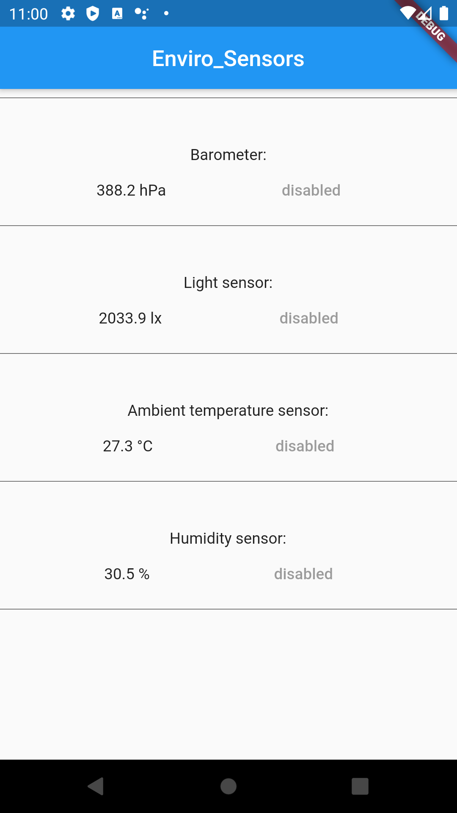

# enviro_sensors
-----------------
A plugin that enables calling native device [enviroment sensors](https://developer.android.com/guide/topics/sensors/sensors_environment). Readings are sent over an EventChannel and can be accessed with a listener to a Dart Stream.

Currently, only android enviroment sensors streams are implemented.

## Getting Started
-------------------
Install the package. 
Add import (i.e. import 'package:enviro_sensors/enviro_sensors.dart';)
Instantiate an appropriate stream (baromterEvents, lightmeterEvents, ambientTempEvents, humidityEvents)
Readings are received as doubles in their corresponding measurement units, and can be accessed in the 
".reading" property of each event. (see [Example/lib/main.dart](https://github.com/barbadose/enviro_sensors/blob/master/example/lib/main.dart) for more).

### TODO: 
---------
- improve the interface for barometerEvents stream, add way to change SENSOR_DELAY if the device
    enables it.
- add barometerEvents stream on iOS.
- write docs and improve "example".
